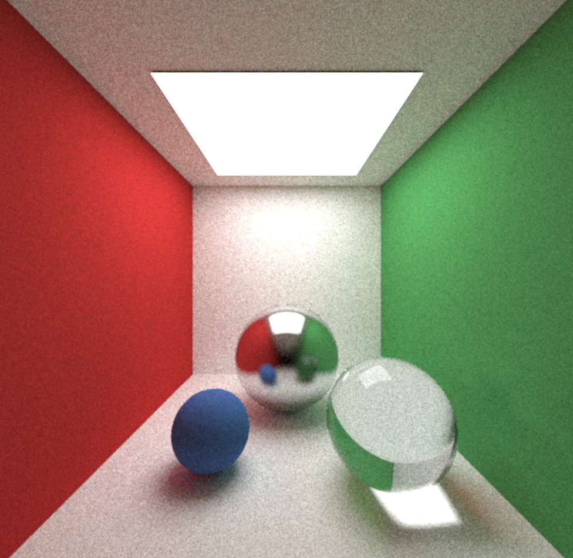

# Примеры трассировки путей на GPU (C++ / OpenGL / GLSL)
Данный репозиторий планировался как набор примеров релизации различных алгоритмов трассировки путей, в целях их "обкатки" в качестве прототипа, для изучения сильных и слабых сторон и дальнейшего использования в более сложных рендерерах.

Репозиторий будет со временем (возможно) поплняться другими примерами

1) Основа. Базовая трассировка путей (простейшая реализация)

   
   
2) Прогрессивная трассировка путей (улучшение картинки с каждым кадром)

   

3) Простейщий денойзинг (Temporal Reprojection + Gaussian Blur)

   

В планах : _importance sampling, двунаправленная (bidirectional) трассировка путей_

Код писался и тестировался при помощи следующего набора инструментов
 - CLion (IDE)
 - MinGW или MSVC (Компиляция и сборка)

Вы можете открыть данный проект при помощи IDE с поддержкой CMake (CLion, Visual Studio 2019) и собрать его, 
либо сгенерировать файлы проекта для подходящей IDE (данный вариант не проверялся).

